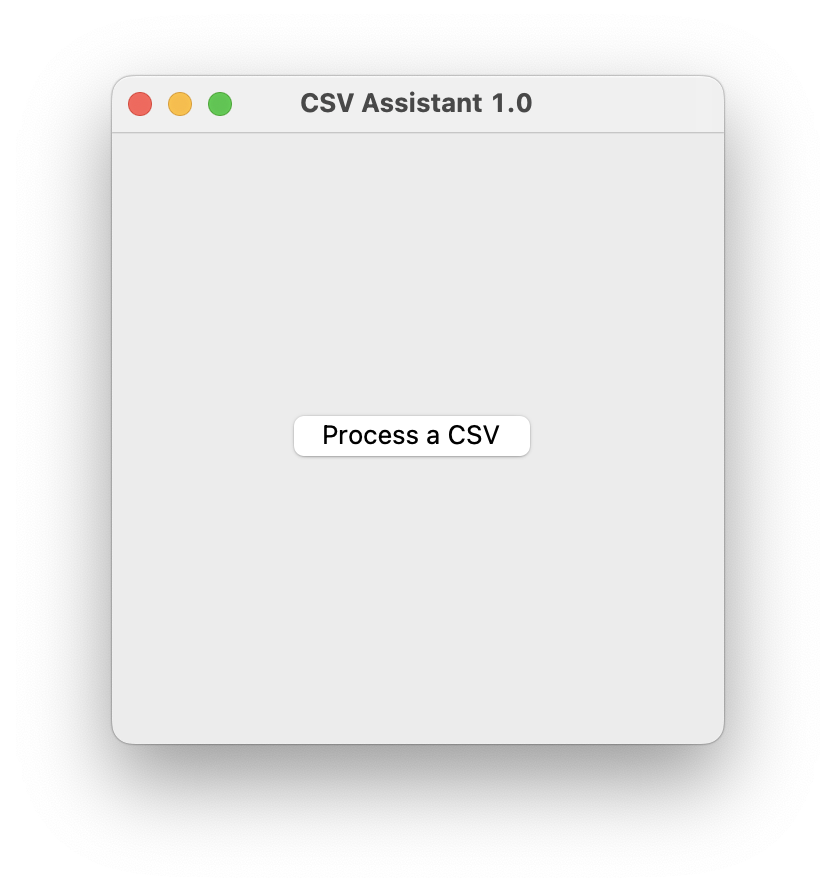

## Welcome to `CSV Assistant 1.0`!


### What it Does
This is a simple program that takes CSV files with the following format:
* CustomerID (String)
* Date (String, in "MM/DD/YYYY" format)
* Amount (Integer)

and generates an output file with the data:
* CustomerID
* MM/YYYY
* Min Balance: Lowest Balance recorded in a month between Day 1 to Day 30
* Max Balance: Highest Balance recorded in a month between Day 1 to Day 30
* Ending Balance: Remaining balance after the Day 30 transaction


### Environmental Prerequisites
The executable, `CSV-Assistant-1.0`, is built with `PyInstaller`. The file is self-contained
and does not require your computer to have Python installed to be executed.

***However***, PyInstaller is OS-dependent: this executable is coded and built 
under the `macOS version 12.5` environment; and it could only be run on a macOS 
machine. 
* To build executable from source-code for non-macOS platforms like Windows, 
please kindly refer to the **Building Executable for Other Environments** section;
* To customize the source-code for optimization and further development, please
have `Python 3.9.12` and above installed on your machine, and consult the `tester.py`
pointer within the **Customizing Program** section.


### How to Use 
Assuming you are currently on a macOS environment:
* macOS is strict about distributed programs like this one; hence your machine is
likely not allowing you to open `CSV Assistant 1.0` by double-clicking the icon.
If this is the case, kindly control-click on the icon then select "open".
* If the program is still not running, please refer to the **Customizing Program** 
section for instructions on how to run the program in your local terminal.

If the program runs, and you are seeing the following interface:


1. Click on the `Process a CSV` button; the program will prompt for an input CSV 
file, select the file and click `Open`;
2. After done processing the file, the program will prompt for a directory to save
the output and a name for the output file (the default name is `data.csv`)–set the 
file directory and name, then clicke `Save`;
3. The program will then ask "Do you want to process another CSV file?"–select `Yes`
to continue processing other files, `No` for the program to wait for further
actions, or close the program.

For best performance, please ensure data from the input file adheres to the format 
specified within the **What it Does** section and does NOT contain a header row.

Thanks!

### Building Executable for Other Environments
PyInstaller can be used to create executables for both Mac and Windows platforms. 
However, you will need to run PyInstaller on a machine that is running the 
platform for which you want to create the executable.

to build a Windows copy, please navigate to the `source` folder and run the 
following command: 

Install PyInstaller using `pip`:
```commandline
pip3 install pyinstaller
```
Run the following command to create an executable:
```commandline
pyinstaller -F -w -n app-name main.py
```
This will create a single file executable with a console window hidden and the specified name app-name.
* The `-F` flag specifies that PyInstaller should create a single file executable.
* The `-w` flag hides the console window when running the executable.
* The `-n app-name` flag specifies the name of the executable file.

For more information, please kindly refer to the `PyInstaller` documentation at https://pyinstaller.readthedocs.io/


### Customizing Program 
Implements a tree-like structure

1. `util.py` 

This files defines classes and objects for organizing the data from input files, and provides helper functions 
for reading, processsing, and saving input data.

The 4 data-holding classes, `Input`, `User`, `Month`, and `Date`, are designed with the following tree-like 
conceptual structure in mind:
```
[Input]           raw_data
                  /   |   \
[User]       user1  user2  ....
                   /  |  \
[Month]     01/2022  02/2022  ....
                     /  \ 
[Date]             01   ....
```
- Each `Input` object holds `User` objects in dictionary `self.users`: the keys are the `CustomerID`s and the values 
hold each customer's data.
- Each `User` object holds `Month` objects in dictionary `self.months`: the keys are the months (in `MM/YYYY` format)
and the values hold each customer's transaction data within a month.
- Each `Month` object holds `Date` objects in dictionary `self.dates`: the keys are the dates and the values hold 
each customer's transaction data within a specific day; in addition, `self.minBalance` holds the values for `Min Balance`
and is initialized to positive infinity, `self.maxBalance` holds the value for `Max Balance` and is initialized to 
negative infinity, `self.endBalance` holds the value for `Ending Balance` and is initialized to 0.
- Each `Date` object holds the total credit and debit transactions within a particular day in `self.cred` and `self.debt`
respectively–both values are initialized to 0.
- Overall, the 4 data-holding classes nests one another and dictionaries are used to implement a prefix-tree; 
this optimizes the process of reading and organizing unsorted data into a clear structure. 
  - The only minor issue is that since Python dictionaries do not sort items upon insertion, and we need to sort the data by month and date for later 
  calculation; however, since there will be at most 12 months in each `self.months` dictionary and at most 31 days in each
  `self.dates` dictionary, such sorting operations essentially have constant Big-O cost and their burden to the overall
  efficiency is trivial.

The data-processing `File_Handler` class contains 4 functions: `read_csv`, `process_csv`, `save_csv`, and `handle_csv`.
- `read_csv` opens the CSV file, iteratively reads in each row in the file while skipping empty rows, calculates the credit
and debit sum within each registered day, and saves the data
in each row in objects of the 4 data-holding classes mentioned above.
- `process_csv` takes the read-in raw data returned by `read_csv` and iterates through each month under a user, each day 
within a month, and each day's credit and debit sums to calculate `Min Balance`, `Max Balance`, and 
`Ending Balance` belonging to each user in a certain month. A user's data from a specific month is stored as a dictionary
item within an array.
  - Note that at lines `100` and `104`, two sets of if statements checks whether the credit and debit transactions have 
  been updates on a day before proceeding to update the `minBalance` and `maxBalance` values: this is to account for the 
  edge case where the transaction on the first day in a month only involves debit, and that debit transaction will become 
  the `maxBalance` of that month.
- `save_csv` takes the returned array from `process_csv` and generates an output csv file to store the processed data.
- Finally, `handle_csv` chains the 3 aforementioned functions together.

2. `main.py`

This file contains the main program that calls the helper functions and provides a minimalistic Graphical User Interface.

The GUI comes with a `Button` widget, which calls the `run` function on-click; within the `run` call, an instance of the 
`File_Handler` class is created and calls the `handle_csv` function.

Eventually, an instance of the `tkinter.filedialog` module asks whether the user wants to process additional CSV files:
if the user clicks `Yes`, it loops back to call `run` once again; otherwise, the program waits for further user actions 
or termination. 

3. `tester.py`

This file provides a tester program for debugging modified code, or function as an alternative executable 
in the case the built executable does not work on a certain machine. 
The program runs on the terminal with no GUI provided.

Its usage it as follows:
```commandline
python3 tester.py <input_file_name> <output_file_name>
```
For instance,
```commandline
python3 tester.py ./in_test.csv ./out_test.csv
```
